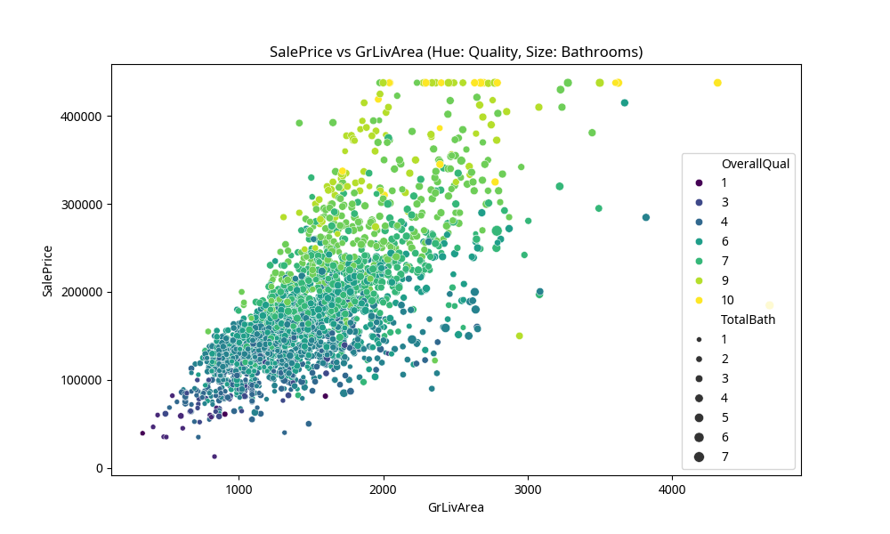

# Capstone Project Report: Ames Housing Data Analysis

## 1. Introduction
This project analyzes the **Ames Housing Dataset**, which contains 2,930 house sales in Ames, Iowa, with over 80 features. The primary goal was to clean the data, engineer new features, and perform exploratory data analysis (EDA) to identify key factors influencing house sale prices.

## 2. Cleaning Summary
The raw dataset was messy, with several issues addressed in Phase 1:
- **Missing Values**: Columns like `PoolQC`, `MiscFeature`, and `Alley` had over 90% missing values. Categorical missing values were filled with 'None', and numerical ones with the median.
- **Data Types**: `MSSubClass` and `Mo Sold` were converted from integers to strings as they represent categorical classifications.
- **Outliers**: Extreme values in `SalePrice` were capped at the 99th percentile to prevent them from skewing the analysis.
- **Duplicates**: The dataset was checked for duplicates, though none were found in this specific version.

## 3. Feature Engineering Summary
New features were created to enhance the predictive power of the data:
- **Encoding**: `MSZoning` and `Street` were one-hot encoded. `ExterQual` was ordinally encoded into a numeric scale (1-5).
- **Domain Features**: 
    - `PricePerSqFt`: Calculated as `SalePrice / GrLivArea` to measure value density.
    - `TotalBath`: Combined full and half baths from both basement and above-grade levels.
- **Interaction**: `Qual_Area_Interact` (OverallQual × GrLivArea) was created to capture the combined effect of size and quality.
- **Transformation**: `LotArea` was log-transformed to handle its high skewness.
- **Binning**: `YearBuilt` was binned into 'Old', 'Recent', and 'New' categories.

## 4. Key Findings
1. **Quality is King**: `OverallQual` has the strongest positive correlation with `SalePrice` (r ≈ 0.80). High-quality houses consistently command higher prices regardless of other factors.
2. **Size Matters**: `GrLivArea` (Above grade living area) is the second most important factor. The scatter plot shows a clear linear relationship between living area and price.
3. **Age Impact**: Newer houses (built after 2000) have a significantly higher mean sale price ($242,379) compared to older houses (pre-1950, $130,840).

### Best Chart: SalePrice vs GrLivArea
The scatter plot below illustrates how price increases with living area, with the color representing quality and size representing the number of bathrooms.

## 5. What I Would Do Next
If given more time, I would:
- **Geospatial Analysis**: Use the Latitude and Longitude data to map house prices and identify "hot" neighborhoods.
- **Advanced Modeling**: Implement a Random Forest or Gradient Boosting model to predict prices more accurately.
- **Feature Selection**: Use Lasso regression to automatically select the most important features and reduce dimensionality further.
